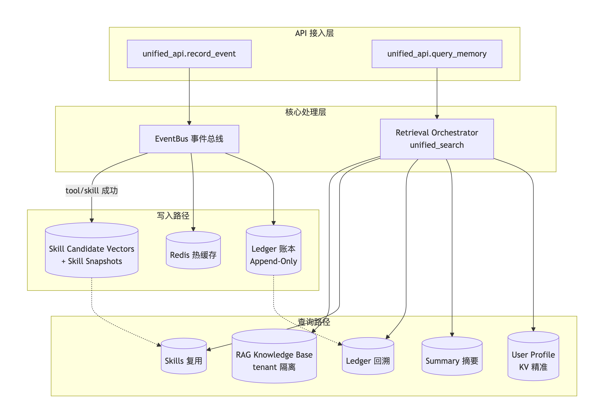
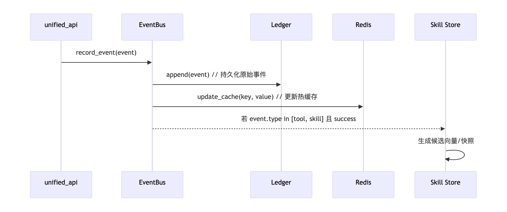
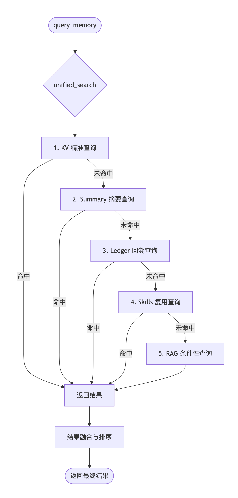
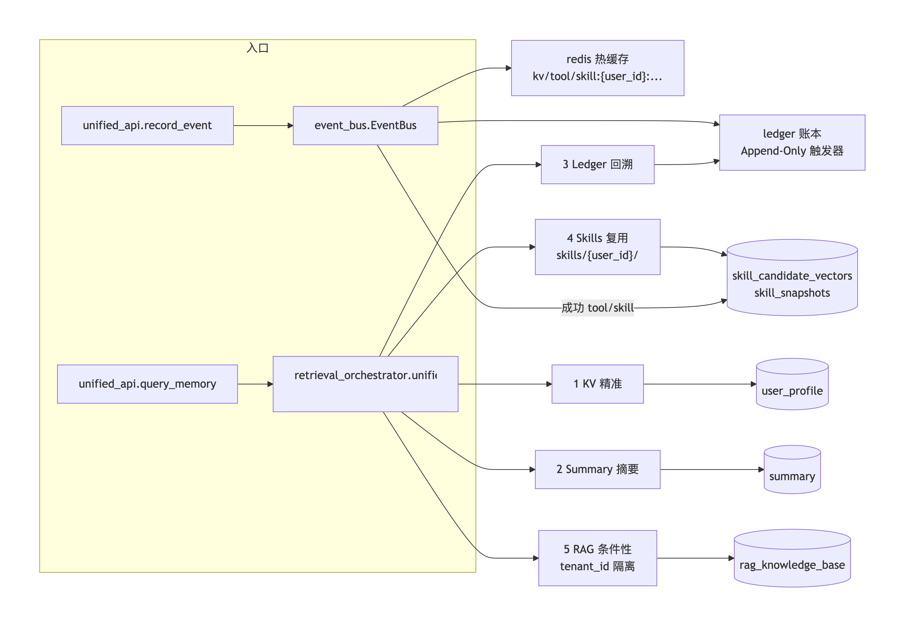

# 分层记忆系统架构（Memory-System）

**License: MIT** · [LICENSE](LICENSE)

生产级 AI Agent 记忆系统：**多租户隔离 + 程序性记忆自进化 + RAG 条件性调用**。

- 六类记忆存储：KV 精准 / Summary 摘要 / Ledger 账本 / 向量语义 / 程序性记忆 / RAG 外部知识
- 五层检索优先级：KV → Summary → Ledger → Skills → RAG
- 统一入口：`record_event()`（写入） / `query_memory()`（读取）
- 完整测试：26 个用例（确定性 / 回溯 / 隔离 / 进化 / 性能）

## 快速开始

### 1. 启动依赖（PostgreSQL + Redis）

```bash
docker compose up -d            # PG16+pgvector + Redis，见 docker-compose.yml
```

### 2. 安装依赖

```bash
python -m venv memory-system-venv
source memory-system-venv/bin/activate
pip install -r requirements.txt
cp .env.example .env            # 填写 DEEPSEEK_API_KEY（可选，缺失时自动降级为规则摘要）
```

### 3. 确认 Ollama（可选，向量/语义能力依赖）

```bash
ollama pull bge-m3              # embedding 模型，用于向量检索与技能匹配
```

### 4. 跑测试

```bash
pytest                          # 26 个用例（配置见 pytest.ini）
```

## 架构一览

### 分层记忆系统架构设计文档

#### 1. 概述

本系统旨在为 AI Agent 提供一套**分层、多级、可回溯**的记忆管理方案。通过将不同粒度和时效性的记忆数据分离存储，并在查询时按优先级进行融合检索，实现高效、准确且可扩展的记忆能力。

核心设计理念：

- **写入与查询分离**：统一写入入口，异步分发；查询时多路召回，按策略融合。
- **事件溯源**：以 Append-Only 日志（Ledger）作为底层事实来源，保证可回溯与审计。
- **多级缓存**：Redis 热缓存加速高频访问，关系型/向量数据库承载持久化与语义检索。
- **技能沉淀**：从用户交互中提取可复用的工具调用或行为模式，形成“技能库”，供后续快速复用。
- **多租户隔离**：所有数据按 `user_id` / `tenant_id` 隔离，保证数据安全。

---

#### 2. 总体架构图



**说明**：  
- 写入时，`record_event` 将事件推入 `EventBus`，由总线负责分发到多个存储。  
- 查询时，`query_memory` 调用 `unified_search`，依次尝试多种检索策略，并最终融合结果。

---

#### 3. 核心模块说明

| 模块                     | 职责                                 | 关键技术                      |
| ------------------------ | ------------------------------------ | ----------------------------- |
| `unified_api`            | 统一对外接口，提供事件记录和记忆查询 | Python / FastAPI              |
| `EventBus`               | 事件分发，解耦写入路径               | 自定义事件总线 / Redis Stream |
| `Retrieval Orchestrator` | 编排多路检索，融合排序               | Python 策略链                 |
| `Ledger`                 | 追加式事件日志，不可变，保证可回溯   | PostgreSQL / SQLite           |
| `Redis`                  | 热数据缓存，加速频繁读取             | Redis                         |
| `Summary`                | 对话摘要，提供概括性记忆             | LLM 生成 + 存储               |
| `Skill System`           | 技能候选向量与快照，实现技能复用     | 向量数据库 + 元数据           |
| `RAG Knowledge Base`     | 外部知识库，按租户隔离               | 向量数据库 + 元数据           |

---

#### 4. 数据流详解

##### 4.1 写入流程（record_event）



**步骤说明**：

1. `unified_api.record_event` 接收标准化事件（含 `user_id`、`event_type`、`payload`、`timestamp`）。
2. `EventBus` 将事件分发到多个下游处理器。
3. `Ledger` 无条件追加事件，确保所有事实可回溯。
4. `Redis` 更新对应键值，如 `kv:user_123:location`。
5. 若事件类型为 `tool` 或 `skill` 且执行成功，则触发技能沉淀流程，将工具调用模式写入技能候选向量库和快照表。

##### 4.2 查询流程（query_memory）



**策略优先级**：从最快、最精确到最慢、最模糊。

| 优先级 | 策略         | 数据源                  | 适用场景                               |
| ------ | ------------ | ----------------------- | -------------------------------------- |
| 1      | KV 精准      | User Profile            | 用户显式设定的固定属性（如位置、偏好） |
| 2      | Summary 摘要 | Summary 表              | 对话总结、近期意图                     |
| 3      | Ledger 回溯  | Ledger 日志             | 历史事件细节、精确时间线               |
| 4      | Skills 复用  | Skill Candidate Vectors | 与历史成功工具调用相似的任务           |
| 5      | RAG 条件性   | RAG Knowledge Base      | 外部知识，需按 `tenant_id` 隔离        |

**条件性 RAG 触发**：当本地记忆均无法提供满意答案，或查询涉及通用知识时启用。

---

#### 5. 存储设计

| 存储                      | 类型                  | 关键字段                                                    | 说明                             |
| ------------------------- | --------------------- | ----------------------------------------------------------- | -------------------------------- |
| `user_profile`            | 关系型 / KV           | `key`, `value`, `user_id`                                   | 精准事实，如 `user_123.location` |
| `summary`                 | 关系型                | `user_id`, `summary_text`, `updated_at`                     | 摘要记忆，定期更新               |
| `ledger`                  | 关系型（Append-Only） | `event_id`, `user_id`, `event_type`, `payload`, `timestamp` | 不可变事件流                     |
| `skill_candidate_vectors` | 向量数据库            | `embedding`, `user_id`, `metadata`                          | 技能候选的语义表示               |
| `skill_snapshots`         | 关系型 / 对象存储     | `skill_id`, `snapshot`, `created_at`                        | 已确认技能的完整快照             |
| `rag_knowledge_base`      | 向量数据库            | `embedding`, `tenant_id`, `doc_id`                          | 外部知识，租户隔离               |

---

#### 6. 关键设计细节

##### 6.1 技能沉淀机制
当 Agent 成功执行某个工具或产生某个技能时，系统会：
1. 将工具调用的输入/输出/描述向量化，存入 `skill_candidate_vectors`。
2. 若该候选技能被多次成功验证，则生成 `skill_snapshot`，作为稳定技能供后续直接调用。

##### 6.2 多租户隔离
所有涉及共享知识的数据（如 RAG 知识库）都带有 `tenant_id` 字段，确保不同租户之间的数据严格隔离。  
查询时必须携带 `tenant_id`，否则返回空结果。

##### 6.3 缓存策略
Redis 中键名格式为 `{type}:{user_id}:{key}`，例如：
- `kv:user_123:location` → 用户位置
- `tool:user_123:last_success` → 最近成功工具
- `skill:user_123:web_search` → 已掌握的技能

缓存设置有 TTL，避免无限膨胀。写入时同步更新，查询时优先命中缓存，未命中则回源到持久化存储。

---

#### 7. 可扩展性与优化建议

1. **查询结果融合**：目前各策略返回结果后简单拼接，未来可引入排序模型或规则引擎，根据置信度加权融合。
2. **异步处理**：技能沉淀、摘要生成等重任务可放入消息队列异步执行，避免阻塞主流程。
3. **监控与告警**：为 `EventBus` 和存储操作添加指标埋点，监控延迟和失败率。
4. **数据归档**：Ledger 数据随时间增长，可定期归档到冷存储，热数据保留近期。
5. **水平扩展**：Redis 和向量数据库均可集群化，`EventBus` 可基于 Kafka/NATS 实现高吞吐。

---

#### 8. 总结

本架构通过 **分层存储 + 多级检索 + 事件溯源 + 技能沉淀** 四大支柱，实现了高效、可扩展、可回溯的 AI 记忆系统。它不仅适用于个人助手，也适用于企业级多租户 Agent 平台。

架构图简版：


**五层检索优先级**：KV（确定）→ Summary（模糊）→ Ledger（回溯）→ Skills（重复复用，跳过推理）→ RAG（条件性，4 种触发条件）。

## 目录结构

```
memory-system/
├── unified_api.py            # 统一入口：record_event / query_memory
├── event_bus.py              # 事件流总线（Ledger + Redis + 候选向量）
├── db_pool.py                # 连接池（SimpleConnectionPool 5-20）
├── cache_manager.py          # Cache-Aside + 分层 TTL + 键命名
├── ledger_api.py             # 账本查询（历史/当前状态/时间范围，user_id 隔离）
├── kv_api.py                 # KV 精准读写（user_id+key 联合主键）
├── summary_api.py            # 滚动摘要
├── vector_semantic.py        # 向量/BM25 混合检索（pgvector）
├── policy_api.py             # Policy：升降级、RAG 条件判定
├── views_api.py              # Views：从 Ledger 聚合状态卡
├── procedural_trigger.py     # 程序性记忆触发（双阈值）
├── skill_candidate_store.py  # 成功任务候选向量
├── skill_generator.py        # SKILL.md 提炼
├── skill_finalizer.py        # 固化快照
├── skill_loader.py           # 技能发现/加载（skills/{user_id}/）
├── skill_matcher_v2.py       # description 语义匹配复用
├── rag_knowledge.py          # RAG 外部知识 + 版本快照
├── retrieval_orchestrator.py # 五层检索编排
├── test_day17/18/19_*.py     # 测试（26 用例）
├── conftest.py               # 测试统一清理（user_test_%）
└── docs/*.md                 # 架构 / 性能 / 阶段总结 / FAQ
```

## 多租户设计要点

- 所有表含 `user_id`，所有查询 `WHERE user_id = %s`
- 缓存键含隔离维度：`kv:{user_id}:{entity_id}:{field}`
- RAG 知识库按 `tenant_id` 隔离（`public` 共享）
- 技能按用户私有目录：`skills/{user_id}/`
- `user_profile` 联合主键 `(user_id, key)`，杜绝 KV DB 层串数据

## 技术栈

PostgreSQL 16 + pgvector · Redis 7 · Python 3.9 · Ollama（bge-m3 embedding）· DeepSeek API

## 文档导航

| 文档 | 内容 |
|---|---|
| `ARCHITECTURE.md` | 竣工架构（5 层检索 + 6 类存储 + LPV + 多租户 + 已知缺口） |
| `性能基线与容量规划.md` | 实测延迟、并发压力、一致性维度 |
| `阶段总结-分层记忆系统架构.md` | 关键决策、踩坑教训、下一步 |
| `生产化准备清单.md` | 生产化待办与文件清单 |
| `FAQ.md` | 常见问题排查 |

## 已知缺口

tool_call/skill_call 不自动传播到向量层与 Summary（需显式同步）；`TTL_RAG` 定义未使用；`SimpleConnectionPool` 非线程安全（生产用 `ThreadedConnectionPool`）；向量层未纳入五层检索链。
