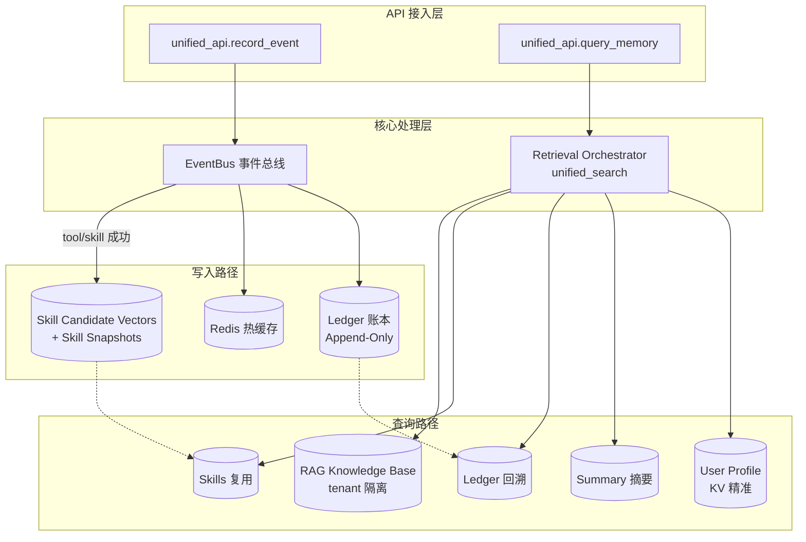
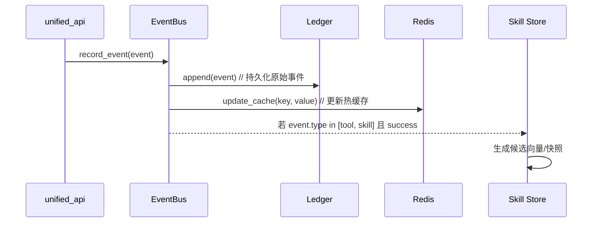
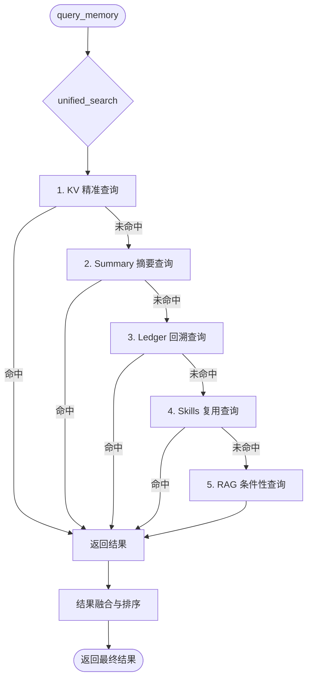

# 总体架构图 README.md#### 2. 总体架构图


# 写入流程 README.md##### 4.1 写入流程（record_event）


# 查询流程（query_memory）README.md######-4.2-查询流程
查询流程-README.md######-4.2-查询流程（query_memory）


# 简版架构图 README.md####8. 总结
简版架构图-README.md####-8. 总结
```mermaid
flowchart LR
    subgraph 入口
        A[unified_api.record_event] --> B[event_bus.EventBus]
        C[unified_api.query_memory] --> D[retrieval_orchestrator.unified_search]
    end

    B --> L[ledger 账本<br/>Append-Only 触发器]
    B --> R[redis 热缓存<br/>kv/tool/skill:{user_id}:...]

    D --> E1[1 KV 精准]
    D --> E2[2 Summary 摘要]
    D --> E3[3 Ledger 回溯]
    D --> E4[4 Skills 复用<br/>skills/{user_id}/]
    D --> E5[5 RAG 条件性<br/>tenant_id 隔离]

    E1 --> K[(user_profile)]
    E2 --> S[(summary)]
    E3 --> L
    E4 --> P[(skill_candidate_vectors<br/>skill_snapshots)]
    E5 --> G[(rag_knowledge_base)]

    B --成功 tool/skill--> P
```